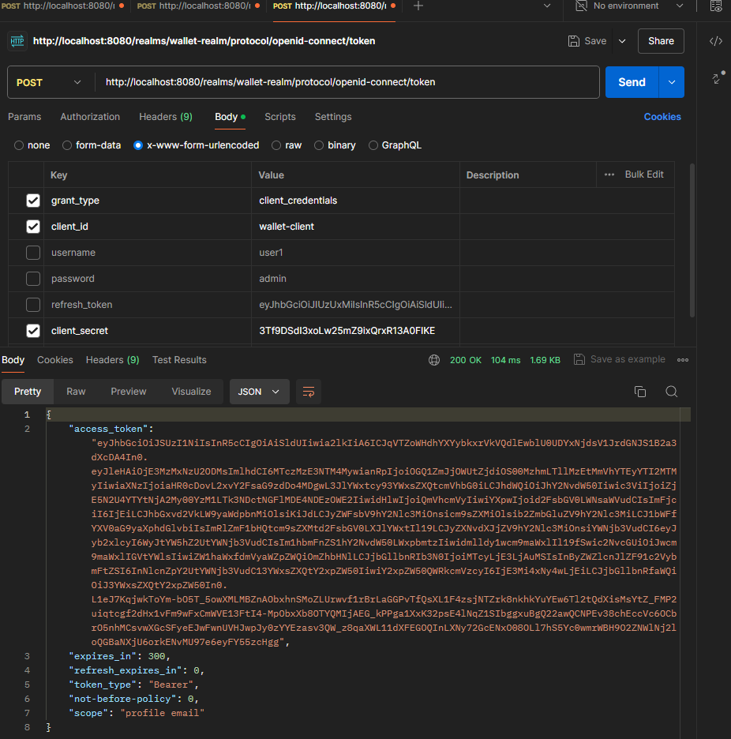

# Démo Application Spring Boot avec Sécurité OAuth2 et OpenID Connect via Keycloak

Ce projet est une démonstration d'une *application Spring Boot*, mettant l'accent sur l'authentification et la sécurité en utilisant *OAuth2* et *OpenID Connect (OIDC)* avec *Keycloak*.

## Introduction

Cette application démontre comment intégrer Keycloak avec une application Spring Boot pour gérer l'authentification et l'autorisation en utilisant les protocoles OAuth2 et OpenID Connect. Nous couvrirons l'installation de Keycloak, la configuration nécessaire, ainsi que des tests d'authentification avec Postman.

## Installation de Keycloak sur Docker

Pour faciliter l'installation, nous utiliserons Docker pour déployer Keycloak.

```bash
# Récupérer l'image Keycloak depuis le registre
docker pull quay.io/keycloak/keycloak

# Lancer un conteneur Keycloak nommé "mykeycloak"
docker run --name mykeycloak -p 8080:8080 \
  -e KEYCLOAK_ADMIN=admin \
  -e KEYCLOAK_ADMIN_PASSWORD=admin \
  quay.io/keycloak/keycloak:latest start-dev
```

---

## Configuration de Keycloak

### Création d'un Realm

Un **realm** dans Keycloak est une espace de noms isolé qui gère un ensemble d'utilisateurs, de rôles et de clients. Il permet de regrouper les configurations de sécurité pour une ou plusieurs applications.

### Création d'un Client

Un **client** représente une application qui demande des informations d'authentification à Keycloak. Il peut s'agir d'une application frontale, d'un service backend, ou d'une application tierce.


### Création d'un Utilisateur

Un **utilisateur** est une identité dans Keycloak qui peut s'authentifier et accéder aux ressources protégées. Les utilisateurs peuvent avoir des rôles et des groupes associés qui définissent leurs permissions.


---

## Test de Connexion avec Postman

Nous allons tester l'authentification en utilisant Postman pour simuler des requêtes OAuth2.

### Grant Type: Password

Le **grant type "password"** est un flux OAuth2 où l'application échange directement les identifiants de l'utilisateur (nom d'utilisateur et mot de passe) contre un token d'accès. Il est généralement utilisé pour les applications de confiance comme les applications internes.


### Décodage du Token JWT

Une fois le token JWT obtenu, il peut être décodé pour visualiser les informations qu'il contient, telles que les revendications (claims), les rôles, l'issuer, etc.


### Grant Type: Client Credentials

Le **grant type "client_credentials"** est utilisé pour l'authentification entre services, où une application s'authentifie elle-même auprès du serveur d'autorisation sans l'intervention d'un utilisateur.




---

## Configuration de l'Application Spring Boot

### Dépendances de Sécurité

Pour sécuriser l'application Spring Boot, ajoutez les dépendances suivantes dans votre `pom.xml` :

```xml
<dependency>
    <groupId>org.springframework.boot</groupId>
    <artifactId>spring-boot-starter-security</artifactId>
</dependency>

<dependency>
    <groupId>org.springframework.security</groupId>
    <artifactId>spring-security-test</artifactId>
    <scope>test</scope>
</dependency>

<!-- Dépendance pour Keycloak (Version compatible avec Spring Boot 2.x) -->
<dependency>
    <groupId>org.keycloak</groupId>
    <artifactId>keycloak-spring-boot-starter</artifactId>
    <version>25.0.3</version>
</dependency>
```

### Propriétés de Configuration de Sécurité

Configurez les propriétés de sécurité dans votre `application.properties` :

```properties
keycloak.realm=wallet-realm
keycloak.resource=wallet-client
keycloak.bearer-only=true
keycloak.auth-server-url=http://localhost:8080/
keycloak.ssl-required=none
```

### Remarque sur Keycloak et Spring Boot 3.x

**Important :** Les adaptateurs Keycloak (`keycloak-spring-boot-starter`) ne sont plus supportés pour les versions de Spring Boot 3.0.0 et supérieures. La meilleure solution est d'utiliser le serveur de ressources OAuth2 de Spring Security.

Ajoutez la dépendance suivante pour utiliser OAuth2 Resource Server :

```xml
<dependency>
    <groupId>org.springframework.boot</groupId>
    <artifactId>spring-boot-starter-oauth2-resource-server</artifactId>
</dependency>
```

Et configurez le `application.properties` comme suit :

```properties
spring.security.oauth2.resourceserver.jwt.issuer-uri=http://localhost:8080/realms/wallet-realm
```

---

Cette démonstration a montré comment configurer Keycloak pour gérer l'authentification et l'autorisation dans une application Spring Boot en utilisant OAuth2 et OpenID Connect.

---